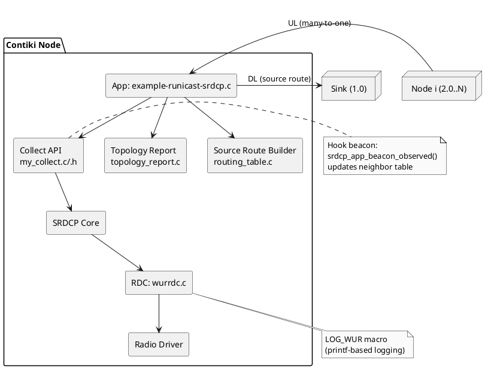
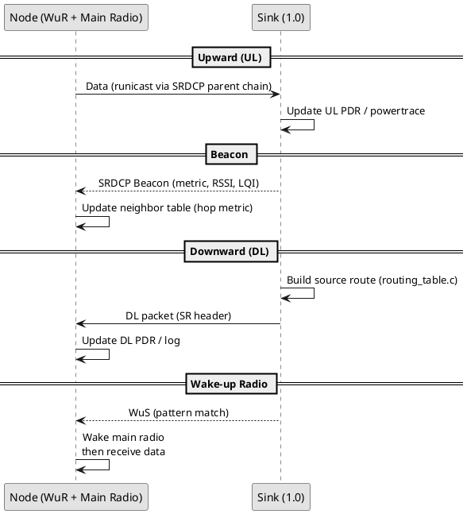

# WaCo × SRDCP – Runicast Example for Contiki/COOJA

> **EN TL;DR:** Minimal integration of **SRDCP** (Source-Routing Data Collection Protocol) with **WaCo** (Wake-up Radio COOJA extension) on Contiki (TARGET=sky) focused on internship report experiments: UL/DL PDR, neighbor table, route changes, and energy (powertrace). Sink is **Node ID = 1** (addr 1.0).

## Mục tiêu
- Tích hợp **SRDCP** vào **WaCo** chạy trên Contiki (TARGET=sky).
- Thực nghiệm 2 chiều: **UL** (nodes → sink) và **DL** (sink → node chọn) dùng **source routing**.
- Thu **metrics phục vụ báo cáo**: PDR UL/DL, bảng láng giềng (hop/metric/RSSI/LQI), thay đổi tuyến/parent/metric/retries, **powertrace** (năng lượng).
- Hook **beacon SRDCP** để thống kê metric ở phía node.

---

## 1) Tính năng chính
- **UL (many-to-one)**: node gửi dữ liệu lên sink (1.0). Sink tính PDR-UL theo từng nguồn.
- **DL (one-to-one source-route)**: sink xây tuyến bằng `routing_table.c` và gửi xuống node đích; node đích tính PDR-DL theo seq.
- **Energy**: `powertrace_start()` bật mặc định (chu kỳ 10s).
- **Log CSV qua `printf`** (để Log Listener lưu file):
  - `UL`: PDR tại sink, theo source.
  - `DL`: PDR tại node đích, theo dest/seq.
  - Bảng láng giềng: **hops ↑, RSSI ↓, last_seen ↓**.
  - Thay đổi tuyến/parent/metric/retries.
  - Hook beacon SRDCP: `metric`, `RSSI`, `LQI`.
- **Wake-up Radio**: có thể bật log WUR (mặc định tắt để tránh nhiễu powertrace).

---

## 2) Cấu trúc thư mục & các file đã chỉnh
```
examples/waco-srdcp/
  example-runicast-srdcp.c    # App UL/DL + log CSV + powertrace
  my_collect.c / my_collect.h # API collect + hook quan sát beacon
  topology_report.c           # In bảng láng giềng/topology
  routing_table.c             # Xây tuyến nguồn (source route) cho DL
  project-conf.h              # Chọn wurrdc_driver, channel, log toggles

core/net/mac/
  wurrdc.c                    # LOG_WUR macro (không dùng wur_trace.h)
```

> **Sink mặc định:** **Node ID = 1** trong COOJA → địa chỉ **1.0**.  
> App có thể dùng `sink_addr` (khai báo trong `my_collect.h`).

---

## 3) Yêu cầu môi trường
- Ubuntu 20.04+ (đã test với 24.04).
- Java + Ant để chạy **COOJA** (`tools/cooja`).
- MSP430 toolchain (build cho TARGET=sky).
- Contiki có tích hợp WaCo; source SRDCP nằm cùng repo hoặc kèm trong ví dụ.

---

## 4) Build & Chạy
```bash
# 1) Về thư mục ví dụ
cd examples/waco-srdcp

# 2) Build cho sky
make clean && make example-runicast-srdcp.sky TARGET=sky

# 3) Mở COOJA
cd ../../tools/cooja && ant run
```

Trong COOJA:
1. Tạo **New Simulation** (radio channel khớp `project-conf.h`, ví dụ 26).
2. **Add motes** → **Sky Mote** → nạp firmware `examples/waco-srdcp/example-runicast-srdcp.sky`.
3. Đặt mote đầu tiên **Node ID = 1** (sink 1.0).
4. Thêm các mote thường: 2.0, 3.0, …
5. Mở **Mote Output / Log Listener** và **Radio Messages** để theo dõi & lưu log CSV.

---

## 5) Tuỳ chọn cấu hình (quan trọng)
- **Bật/Tắt log WuR** (mặc định **tắt** để không nhiễu powertrace):
  - Trong `project-conf.h` thêm:
    ```c
    #define LOG_WUR 1
    ```
  - Hoặc tại dòng lệnh:
    ```bash
    make example-runicast-srdcp.sky TARGET=sky CFLAGS='-DLOG_WUR=1'
    ```
- **Kỳ gửi & số node DL**: trong `example-runicast-srdcp.c`
  - `MSG_PERIOD` (chu kỳ gửi UL)
  - `APP_NODES` (số node quay vòng DL hoặc danh sách đích)
- **Độ dài đường đi tối đa**: `MAX_PATH_LENGTH` trong `routing_table.c`.
- **Chu kỳ in bảng láng giềng / PDR**: `NEI_PRINT_PERIOD`, `PDR_PRINT_PERIOD` (nếu bạn có define).
- **Kênh radio, TX power, …**: chỉnh trong `project-conf.h` cho thống nhất mô phỏng.

---

## 6) Hook beacon SRDCP (ở phía app)
Hàm app có thể định nghĩa (hoặc dùng **stub yếu** nếu muốn build ví dụ khác mà không cần hook):
```c
void srdcp_app_beacon_observed(const linkaddr_t *sender,
                               uint16_t metric, int16_t rssi, uint8_t lqi);
```
- Mục đích: cập nhật bảng láng giềng bằng hop/metric khi **nghe beacon** từ hàng xóm.

---

## 7) Ghi log & thu thập số liệu
- **Powertrace**: đã bật trong app (chu kỳ mặc định 10s).  
  Lưu log qua **Log Listener → Save to file** để phân tích năng lượng.
- **Tag log** (gợi ý lọc):
  - `SRDCP`, `UC` (runicast), `COLLECT` (UL), `TOPO` (neighbor/topology), `UL` (tổng hợp UL), `BEACON` (quan sát beacon), `SRDCP/PIGGY` (nếu có gói piggyback).
- **Đầu ra tối thiểu cho báo cáo**:
  - Bảng PDR-UL theo từng source tại sink.
  - Bảng PDR-DL theo từng dest tại node đích (tính theo seq).
  - Bảng láng giềng có **hop(metric)/RSSI/LQI/last_seen**.
  - Log thay đổi tuyến/parent/metric/retries.
  - Bảng powertrace tổng hợp theo thời gian.

---

## 8) Quy trình thí nghiệm mẫu (gợi ý)
1. **Baseline**: LOG_WUR=0, N=5 nodes, `MSG_PERIOD = 30 s`, kênh 26, TX power mặc định.
2. **Bật WUR log**: LOG_WUR=1 → so sánh độ nhiễu log lên powertrace, điều chỉnh kỳ in nếu cần.
3. **Tăng mật độ**: N=10–15 nodes, giữ `MSG_PERIOD`, đo PDR/energy.
4. **Nhiễu kênh**: đổi kênh hoặc chèn interferer (tuỳ setup) để đo PDR/parent switch.
5. **Tối ưu**: thay đổi `MAX_PATH_LENGTH`, `NEI_PRINT_PERIOD`, `PDR_PRINT_PERIOD` để cân bằng log/độ mượt.

---

## 9) Sơ đồ (PlantUML)

### 9.1 Kiến trúc mức cao


### 9.2 Trình tự UL/DL + Wake-up


---

## 10) Lỗi thường gặp & khắc phục
- **Không thấy log WUR** → bật `LOG_WUR` (mục 5).
- **Cảnh báo `implicit declaration of memcpy`** → thêm `#include <string.h>`.
- **Thiếu kiểu `uint16_t/uint8_t`** → thêm `#include <stdint.h>`.
- **`undefined reference to srdcp_app_beacon_observed`** → đảm bảo app định nghĩa hoặc thêm **stub yếu** trong `my_collect.c`.
- **PDR/Powertrace nhiễu do log quá nhiều** → tắt `LOG_WUR` hoặc tăng chu kỳ in `NEI_PRINT_PERIOD`/`PDR_PRINT_PERIOD`.

---

## 11) Vệ sinh repo (.gitignore gợi ý)
```gitignore
# Build artifacts
*.o
*.d
*.a
*.out
*.map
*.elf
*.bin
*.hex

# Contiki / COOJA
*.sky
*.z1
obj_*/
build*/
*.class
*.jar
*.cooja
*.csc.backup

# Logs & temp
COOJA.log
log.log
log*.log
*.csv
*.tmp

# IDE / OS
.DS_Store
Thumbs.db
.vscode/
.idea/
*~
```

---

## 12) Bản quyền & nguồn
- WaCo: https://github.com/waco-sim/waco  
- SRDCP: https://github.com/StefanoFioravanzo/SRDCP  
Repo này tuân theo giấy phép của các dự án gốc (xem LICENSE tương ứng nếu kèm theo).
